# MSA-JohnS-Phase1-2020

## Show SQL database through the Query editor (screenshots) for both tables with rows of example instances
 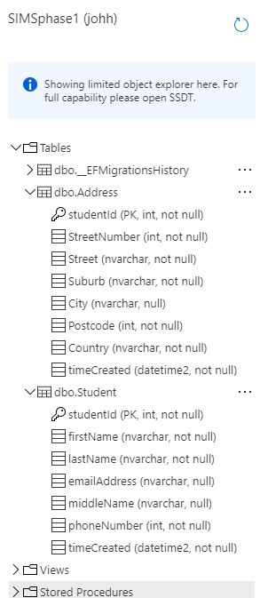

## Create basic CRUD requests for the Student table
 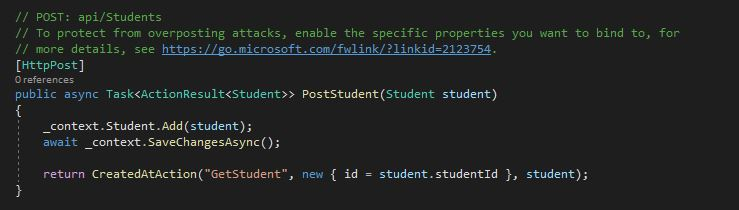
 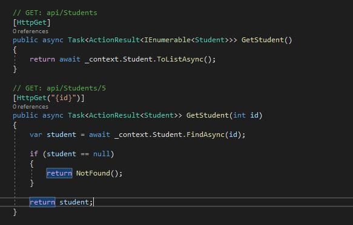
 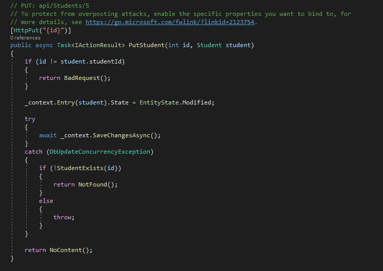
 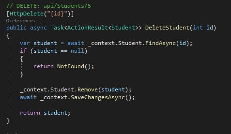

## Create basic CRUD requests for the Address table
 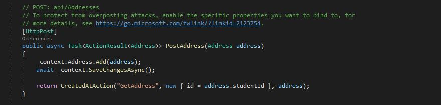
 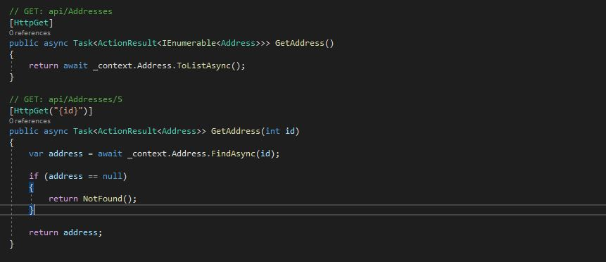
 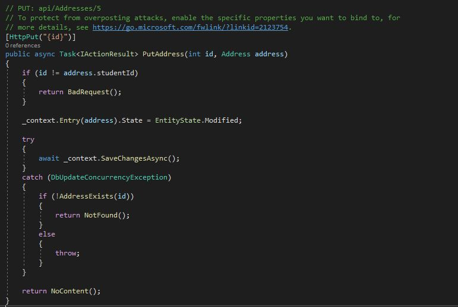
 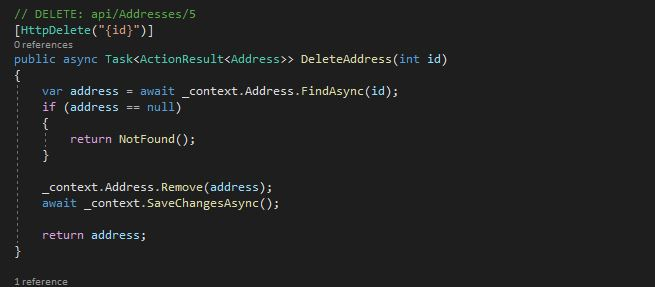

## Create an API method that adds new address for a student using his/her StudentId.
 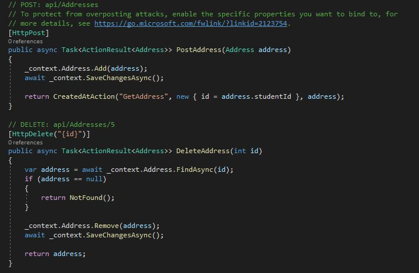

## Create an API method that changes the address of a student using his/her StudentId.
 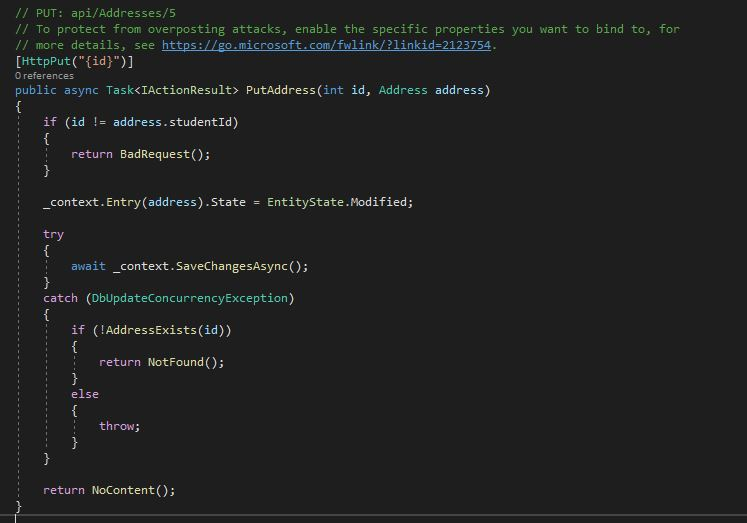

## Screenshot of Swagger UI showing all API Endpoints
 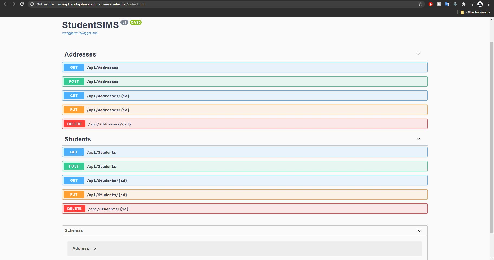
